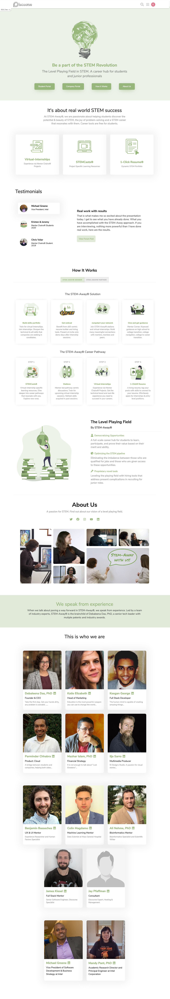
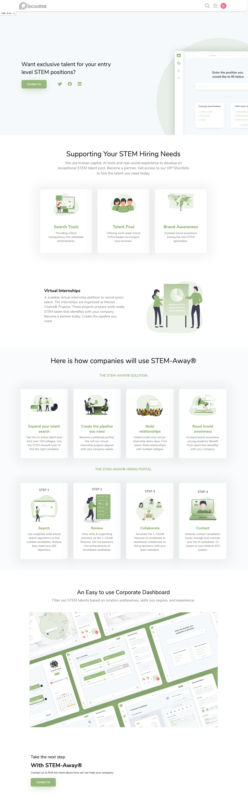

# STEM-Away's Static Pages Plugin Repository
A repository to house STEM-Away's static pages as a plugin. Specifically, the pages created are the about page and the company page.

## Routes

The About page is located at: /pages/about
The Company page is located at: /pages/company

## Prefixes

All css style variables and the structure of folders is prefixed by: 
"spages" to show that it is from this plugin.

## Screenshots

  
  

